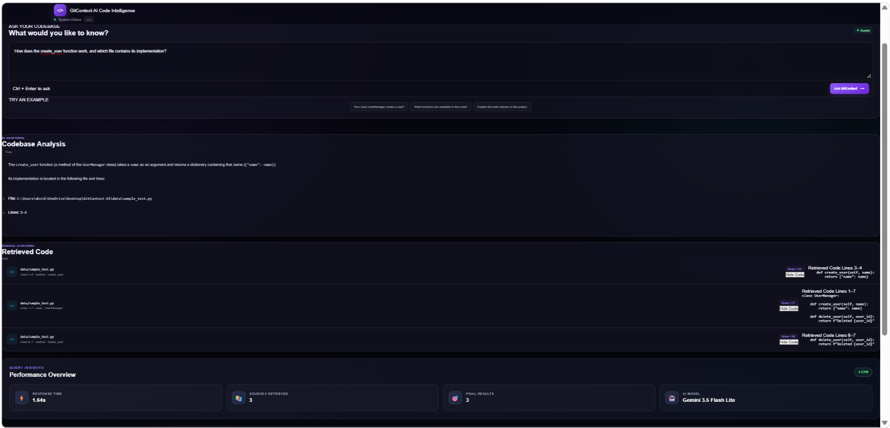

```markdown
# 🧠 GitContext-AI

### 🚀 AI-Powered Codebase Intelligence & Developer Copilot using Hybrid RAG

<p align="center">
  <b>Understand. Search. Reason. Navigate your codebase with AI.</b>
</p>

<p align="center">


</p>

---

## 🎯 What is GitContext-AI?

**GitContext-AI** is an AI-powered developer copilot that allows developers to understand and search their codebase using natural language.

It combines **AST-based code understanding, semantic search, BM25, hybrid retrieval, reranking, and Gemini RAG** to provide relevant and grounded answers with source citations.

Example:

> **"How does UserManager create a user?"**

---

## 💡 Problem Statement

Large codebases contain thousands of lines of code across multiple files and modules. Finding the correct implementation using traditional keyword search can be difficult when the developer does not know the exact function, class, or file name.

### 🚀 Solution

```text
Natural Language Question
          ↓
Code Understanding
          ↓
Hybrid Retrieval
          ↓
Reranking
          ↓
Relevant Code Context
          ↓
Gemini RAG
          ↓
Answer + Source Citations
```

---

## ✨ Key Features

- 🔗 **GitHub Repository Intelligence** – Repository ingestion and file discovery
- 🧠 **AST Code Understanding** – Functions, classes, methods and structure
- 🔎 **Semantic Search** – Vector-based code retrieval
- 🔤 **BM25 Search** – Keyword-based retrieval
- 🔀 **Hybrid Retrieval** – Combines semantic + keyword search
- 🎯 **Cross-Encoder Reranking** – Improves result relevance
- 🤖 **Gemini RAG** – Generates context-grounded answers
- 📌 **Source Citations** – File paths, lines and code snippets
- 📊 **Retrieval Evaluation** – Precision@3, Recall@3, MRR and Accuracy
- 🧪 **Automated Testing** – 8/8 tests passed

---

## 🏆 Why GitContext-AI?

| Capability | Status |
|---|:---:|
| Natural-language code queries | ✅ |
| AST-based code understanding | ✅ |
| Semantic search | ✅ |
| BM25 keyword search | ✅ |
| Hybrid retrieval | ✅ |
| Cross-encoder reranking | ✅ |
| Gemini RAG | ✅ |
| Source citations | ✅ |
| Automated testing | ✅ |

---

## 🏗️ System Architecture


```text
GitHub Repository
       ↓
Repository Ingestion
       ↓
File Discovery & AST Parsing
       ↓
Code Chunking
       ↓
FastEmbed
       ↓
Qdrant Vector Store
       ↓
Semantic Search + BM25
       ↓
Hybrid Retrieval
       ↓
Cross-Encoder Reranking
       ↓
Gemini RAG
       ↓
FastAPI
       ↓
Developer Dashboard
```

---

## 🔄 How It Works

1. **Ingest** – Load the GitHub repository.
2. **Understand** – Parse source code using Python AST.
3. **Chunk** – Create structure-aware code chunks.
4. **Embed** – Generate 384-dimensional embeddings using `BAAI/bge-small-en-v1.5`.
5. **Store** – Store embeddings in Qdrant.
6. **Retrieve** – Combine semantic search and BM25.
7. **Rerank** – Rank results using a cross-encoder.
8. **Generate** – Use Gemini RAG to create a grounded answer.
9. **Cite** – Return relevant files, lines and source code.

---

## 🖥️ Developer Dashboard

- 💬 Natural-language queries
- 🤖 AI-generated answers
- 📂 Dynamic source citations
- 👀 Expandable code snippets
- 📊 Query insights
- 📈 Retrieval quality metrics
- 🔄 Retrieval pipeline visualization



---

## 📊 System Performance

| Metric | Result |
|---|---:|
| Precision@3 | **33%** |
| Recall@3 | **100%** |
| MRR | **75%** |
| Retrieval Accuracy | **100%** |
| Automated Tests | **8/8 Passed** |
| Sample Response | **~1.58s** |

---

## 🔍 Example Query

**Question**

```text
How does UserManager create a user?
```

**Retrieved Source**

```text
File: data/sample_test.py
Element: create_user
Lines: 3-4
Type: method
```

The system retrieves the relevant code, reranks it, and generates a grounded explanation using Gemini.

---

## 🔄 Complete RAG Pipeline

```text
User Question
      ↓
Semantic Search + BM25
      ↓
Hybrid Retrieval
      ↓
Cross-Encoder Reranking
      ↓
Relevant Code Context
      ↓
Gemini RAG
      ↓
Grounded Answer + Sources
```

---

## 🛠️ Technology Stack

| Layer | Technology |
|---|---|
| Language | Python 3.12 |
| Frontend | HTML, CSS, JavaScript |
| Backend | FastAPI |
| LLM | Google Gemini |
| Embeddings | FastEmbed |
| Vector Database | Qdrant |
| Keyword Search | BM25 |
| Reranking | Cross Encoder |
| Code Analysis | Python AST |
| Testing | Pytest |
| Version Control | Git & GitHub |

---

## 📁 Project Structure

```text
GitContext-AI/
├── backend/
├── data/
├── docs/
├── evaluation/
├── frontend/
├── ingestion/
├── llm/
├── retrieval/
├── tests/
├── .env.example
├── .gitignore
├── README.md
└── requirements.txt
```

---

## ⚙️ Installation

```bash
git clone https://github.com/Devika262006/GitContext-AI.git
cd GitContext-AI

python -m venv venv
venv\Scripts\activate

pip install -r requirements.txt
```

---

## 🔐 Environment Configuration

Create a `.env` file:

```env
GITHUB_TOKEN=your_github_token_here
GEMINI_API_KEY=your_gemini_api_key_here
GEMINI_MODEL=gemini-3.5-flash-lite
QDRANT_URL=http://localhost:6333
QDRANT_API_KEY=
EMBEDDING_MODEL=BAAI/bge-small-en-v1.5
```

**Never commit `.env` to GitHub.**

---

## ▶️ Running Backend

```bash
venv\Scripts\activate
uvicorn backend.main:app --reload
```

**Backend:** `http://127.0.0.1:8000`

**Swagger:** `http://127.0.0.1:8000/docs`

---

## 🔌 API Documentation

### `POST /ask`

```json
{
  "question": "How does UserManager create a user?"
}
```

### `GET /evaluation`

Returns:

- Precision@3
- Recall@3
- MRR
- Retrieval Accuracy

---

## 🧪 Automated Testing

Run:

```bash
pytest -v
```

Result:

```text
8 passed
```

---

## 📈 Retrieval Evaluation

| Metric | Result |
|---|---:|
| Precision@3 | **33%** |
| Recall@3 | **100%** |
| MRR | **75%** |
| Retrieval Accuracy | **100%** |

---

## 🔐 Security

- 🔒 API keys stored in environment variables
- 🚫 `.env` excluded from Git
- 🚫 Local Qdrant storage excluded
- 🚫 Local repository data excluded
- 🔑 No hardcoded secrets

---

## 🚀 Future Enhancements

- 🌐 Multi-language code intelligence
- 🐙 GitHub Pull Request analysis
- 🔍 Vulnerability detection
- 🤖 Automated code review
- 🐛 Agentic debugging
- 🕸️ Dependency graph generation
- 📚 Multi-repository intelligence
- 🐳 Docker deployment
- ☁️ Cloud Qdrant
- 🔄 Continuous repository indexing

---

## 🎓 Research & Learning Value

GitContext-AI combines:

**Artificial Intelligence • NLP • Information Retrieval • Vector Databases • LLMs • RAG • API Development • Automated Testing**

Suitable for:

- 🎓 Final-year projects
- 🤖 AI/ML portfolios
- 🔎 RAG projects
- 💻 Developer portfolios
- 📚 Academic demonstrations

---

## 👩‍💻 Author

### Devika S

**B.Tech Artificial Intelligence & Machine Learning**  
**IFET College of Engineering**

**GitHub:** https://github.com/Devika262006

**LinkedIn:** https://www.linkedin.com/in/devika-s-6880602b4
```