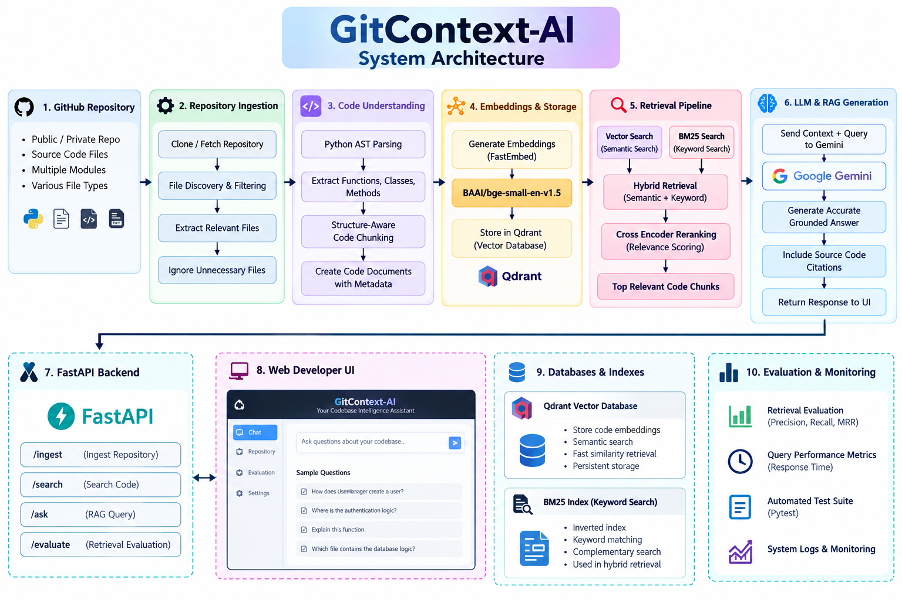

# 🧠 GitContext-AI

### End-to-End Codebase Intelligence & Developer Copilot using Hybrid RAG

GitContext-AI is an intelligent codebase assistant that understands software repositories and provides accurate, context-aware answers to developer questions.

It combines **AST-based code understanding, semantic search, BM25 keyword search, hybrid retrieval, reranking, and Gemini-powered RAG** to retrieve relevant code and generate grounded answers.

---

## 🚀 Key Features

- 🔗 GitHub repository ingestion
- 📂 Intelligent source-code discovery
- 🌳 AST-based Python code parsing
- ✂️ Structure-aware code chunking
- 🧠 Semantic embeddings using FastEmbed
- 🔎 Vector search using Qdrant
- 🔤 BM25 keyword search
- 🔀 Hybrid semantic + keyword retrieval
- 🎯 Cross-encoder reranking
- 🤖 Gemini-powered RAG answer generation
- 📌 Dynamic source-code citations
- 👀 Expandable "View Code" source snippets
- 📊 Query performance metrics
- 📈 Retrieval quality evaluation
- 🧪 Automated test suite
- ⚡ FastAPI backend
- 💻 Interactive developer dashboard
- 🔐 Environment-variable based secret management

---

## 🏗️ System Architecture


```text
                 ┌──────────────────────┐
                 │   GitHub Repository  │
                 └──────────┬───────────┘
                            │
                            ▼
                 ┌──────────────────────┐
                 │ Repository Ingestion │
                 └──────────┬───────────┘
                            │
                            ▼
                 ┌──────────────────────┐
                 │ File Discovery       │
                 │ & Filtering          │
                 └──────────┬───────────┘
                            │
                            ▼
                 ┌──────────────────────┐
                 │ AST Code Parser      │
                 └──────────┬───────────┘
                            │
                            ▼
                 ┌──────────────────────┐
                 │ Code Chunking        │
                 └──────────┬───────────┘
                            │
                            ▼
                 ┌──────────────────────┐
                 │ FastEmbed            │
                 │ BGE-small-en-v1.5    │
                 └──────────┬───────────┘
                            │
                            ▼
                 ┌──────────────────────┐
                 │ Qdrant Vector Store  │
                 └──────────┬───────────┘
                            │
                 ┌──────────┴──────────┐
                 ▼                     ▼
        ┌────────────────┐    ┌────────────────┐
        │ Vector Search  │    │ BM25 Search    │
        └───────┬────────┘    └───────┬────────┘
                │                     │
                └──────────┬──────────┘
                           ▼
                 ┌──────────────────────┐
                 │ Hybrid Retrieval     │
                 └──────────┬───────────┘
                            │
                            ▼
                 ┌──────────────────────┐
                 │ Cross Encoder        │
                 │ Reranking            │
                 └──────────┬───────────┘
                            │
                            ▼
                 ┌──────────────────────┐
                 │ Gemini RAG Generator │
                 └──────────┬───────────┘
                            │
                            ▼
                 ┌──────────────────────┐
                 │ FastAPI Backend      │
                 └──────────┬───────────┘
                            │
                            ▼
                 ┌──────────────────────┐
                 │ Web Developer UI     │
                 └──────────────────────┘

🛠️ Technology Stack
Layer	Technology
Frontend	HTML, CSS, JavaScript
Backend	FastAPI
Language	Python 3.12
LLM	Google Gemini
Embeddings	FastEmbed
Embedding Model	BAAI/bge-small-en-v1.5
Vector Database	Qdrant
Keyword Search	BM25
Reranking	Cross Encoder
Code Understanding	Python AST
Testing	Pytest
Version Control	Git & GitHub


📁 Project Structure
GitContext-AI/
│
├── backend/
│   └── main.py
│
├── ingestion/
│   ├── github_loader.py
│   ├── file_discovery.py
│   ├── code_parser.py
│   ├── code_chunker.py
│   ├── document_schema.py
│   └── embedding_generator.py
│
├── retrieval/
│   ├── vector_store.py
│   ├── vector_search.py
│   ├── bm25_search.py
│   ├── hybrid_search.py
│   ├── reranker.py
│   └── retrieval_pipeline.py
│
├── llm/
│   ├── llm_client.py
│   └── rag_generator.py
│
├── evaluation/
│   └── retrieval_evaluation.py
│
├── frontend/
│   ├── index.html
│   ├── style.css
│   └── script.js
│
├── tests/
│   ├── conftest.py
│   ├── test_parser.py
│   ├── test_chunker.py
│   ├── test_retrieval.py
│   ├── test_evaluation.py
│   └── test_api.py
│
├── data/
├── requirements.txt
├── .env.example
├── .gitignore
└── README.md

⚙️ Installation
1. Clone the repository
git clone https://github.com/Devika262006/GitContext-AI.git
cd GitContext-AI

2. Create virtual environment
python -m venv venv

3. Activate virtual environment
Windows
venv\Scripts\activate

4. Install dependencies
pip install -r requirements.txt

🔐 Environment Configuration
Create a .env file:
GITHUB_TOKEN=your_github_token_here

GEMINI_API_KEY=your_gemini_api_key_here
GEMINI_MODEL=gemini-3.5-flash-lite

QDRANT_URL=http://localhost:6333
QDRANT_API_KEY=

EMBEDDING_MODEL=BAAI/bge-small-en-v1.5

Never commit your .env file or API keys to GitHub.

▶️ Running the Backend
Activate the virtual environment:
venv\Scripts\activate

Start FastAPI:
uvicorn backend.main:app --reload

Backend:
http://127.0.0.1:8000

Swagger API documentation:
http://127.0.0.1:8000/docs

💻 Running the Frontend
Open:
frontend/index.html

using VS Code Live Server.
The frontend communicates with the FastAPI backend through the /ask endpoint.
🔍 Example Questions
GitContext-AI can answer questions such as:
How does UserManager create a user?

Where is the authentication logic implemented?

What does this function do?

Which file contains the database logic?

Explain the main class in this project.

How does data flow through this function?

📊 Retrieval Evaluation
The system includes an automated retrieval evaluation module.
Current evaluation metrics:
Metric	Result
Precision@3	33%
Recall@3	100%
MRR	75%
Retrieval Accuracy	100%


These metrics are displayed directly in the developer dashboard.
🧪 Automated Testing
Run the complete test suite:
pytest -v

Current test status:
8 passed

Test coverage includes:
- API endpoints
- Python AST parser
- Code chunking
- Retrieval pipeline
- Retrieval evaluation
🔄 RAG Pipeline
User Question
      ↓
Vector Search
      +
BM25 Keyword Search
      ↓
Hybrid Retrieval
      ↓
Cross-Encoder Reranking
      ↓
Top Relevant Code
      ↓
Gemini
      ↓
Grounded Answer
      ↓
Source Citations

🎯 Why GitContext-AI?
Traditional code search mainly depends on exact keyword matching.
GitContext-AI combines:
Semantic Understanding + Keyword Search + Reranking + LLM Reasoning
This allows developers to ask natural-language questions about a codebase instead of manually searching through multiple files.
🔒 Security
- API keys are stored using environment variables.
- .env is excluded through .gitignore.
- Local Qdrant storage is excluded from Git.
- Repository data is excluded from Git.
- Sensitive credentials are never stored in source code.
🌟 Future Enhancements
- Multi-language AST support
- GitHub pull-request analysis
- Code vulnerability detection
- Automated code review
- Repository-level dependency graphs
- Agentic debugging
- Docker deployment
- Cloud-hosted Qdrant
- Multi-repository intelligence
- Developer productivity analytics
👩‍💻 Author
Devika S
B.Tech Artificial Intelligence & Machine Learning
IFET College of Engineering
GitHub:
https://github.com/Devika262006
📄 License
This project is developed for educational, research, and portfolio purposes.